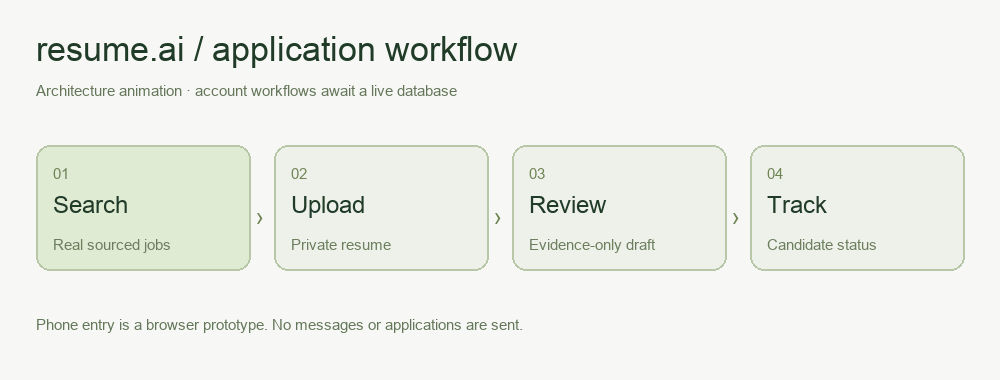
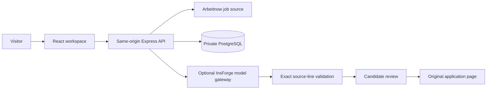

# 🧭 resume.ai — startup release candidate

Find sourced openings. Prepare a resume from your actual experience. Review before applying.

**[Open the deployment](https://resume-ai-startup.vercel.app)** · **[System map](vault/System%20Map.md)** · **[Launch status](vault/Launch%20Status.md)**

> **Release status:** real public job search is deployed. Private account workflows are implemented and tested with an isolated test repository, but await a working persistent database. The original InsForge project returned “No backend services available.” This is not yet a completed startup launch.

## 🎬 The workflow



This is an architecture animation, not a recording of completed signup or messaging. The text entry is a browser prototype; no SMS, outreach, or employer applications are sent.

## 🚦 What works, and what still needs connection

| Capability                       | Implementation                                                                      | Live status                                                      |
| -------------------------------- | ----------------------------------------------------------------------------------- | ---------------------------------------------------------------- |
| Public job search without signup | Same-origin API, real Arbeitnow listings, provenance and retrieval dates            | Deployed; final deployment checks recorded in the release report |
| Login and registration           | Password hashes, server-validated HttpOnly session cookies, logout revocation       | Waiting for database connection                                  |
| Resume upload                    | PDF / DOCX / TXT / Markdown, 4 MB limit, private server storage                     | HTTP integration tests pass; live database unverified            |
| Draft selection and review       | Original and selected resume lines shown together; unsupported model lines rejected | Gate tested; live AI gateway unverified                          |
| Application tracker              | Durable job snapshots; candidate-reported states                                    | Tests pass; live database unverified                             |
| Launch email collection          | Explicit consent, persistence, opaque unsubscribe token                             | Tests pass; live persistence unverified; no updates sent         |
| Phone entry                      | Browser “JOBS …” command searches real data                                         | Prototype; no carrier number                                     |
| Outcome metrics                  | Candidate-maintained statuses, null unknown probabilities                           | No fabricated ATS, salary, interview, or response claims         |

## 🧩 Architecture



The API can use a direct `DATABASE_URL` or a restored InsForge project. The additive schema uses `startup_*` tables and does not modify the old application's tables. No production memory database or browser demo-login fallback exists.

### Data boundaries

- Public listings can be browsed without providing email or phone details.
- Passwords are hashed with bcrypt. Session cookies are HttpOnly, SameSite=Lax, and Secure in production. Stored session records allow revocation on logout.
- Resumes are parsed in memory, then stored as private text through the server. No public resume URL is created. Uploaded binaries are not retained.
- Each private request is scoped to its authenticated account. Profile edits cannot change login identity or introduce admin roles.
- Application records retain title/company/source snapshots, so refreshed listings cannot erase history.
- The model can select only exact nonempty lines in the supplied resume. The server rejects unsupported lines. This prevents newly invented qualifications in the selected draft; it does not establish that every user-supplied claim is true.
- Candidate statuses are self-reported. A source link opening is not an application receipt. This release sends no recruiter email or SMS.
- Operational logs use request IDs and status codes, not resume text, email addresses, passwords, or provider keys.

## 🛠️ Run locally

Use Node.js 22 or newer.

```sh
npm ci
cp .env.example .env.local
```

Configure a server-only database and a random signing secret of at least 32 characters. Install the additive schema using a privileged database connection:

```sh
npm run db:migrate
npm run dev:api
```

In another terminal:

```sh
npm run dev
```

Open `http://127.0.0.1:5173`. Vite proxies `/api` to the backend on port 3001. Public search still works with storage disconnected; private operations return explicit availability errors.

### Environment variables

| Variable              | Purpose                                                                      | Required                  |
| --------------------- | ---------------------------------------------------------------------------- | ------------------------- |
| `DATABASE_URL`        | Server-only PostgreSQL connection                                            | One persistent backend    |
| `INSFORGE_ENDPOINT`   | Alternative restored database/model gateway                                  | If using InsForge         |
| `INSFORGE_SECRET_KEY` | Server credential with database privileges; never browser-side               | If using InsForge         |
| `JWT_SECRET`          | Random session signing secret, at least 32 characters                        | Private workflows         |
| `APP_URL`             | Allowed write-request origin; local default in example                       | Set for local development |
| `AI_MODEL`            | Optional model gateway name; default preserves existing `openai/gpt-4o-mini` | Live model gateway        |

Secrets belong in `.env.local` or Vercel environment settings. Do not commit them or prefix them with `VITE_`. For deployment, same-origin requests need no browser API URL setting.

## ☁️ Deployment

The Vite frontend and `api/index.js` are deployed together. API rewrites precede the page fallback; unknown API routes return JSON 404 rather than a successful HTML page. The canonical deployment is `https://resume-ai-startup.vercel.app`.

`GET /api/health` returns JSON. HTTP 503 and `degraded` mean the database or signing configuration is unavailable; a rendered homepage is not proof that private workflows are operational.

After database provisioning:

1. Configure production server variables.
2. Apply `server/schema.sql` through the selected privileged database connection.
3. Verify database privileges and cross-account isolation against the actual live adapter.
4. Run signup → login → private upload → model draft → review → save → update → logout, using an owned test account and test resume.
5. Verify deployment logs contain no private payloads. Verify backups and a restore procedure before public onboarding.

Deployment changes can be reviewed in a separate Vercel preview. The original `resume-ai-eta-flax.vercel.app` site and the other agent's checkout have not been overwritten by this candidate.

## 🧪 Verification

```sh
npm run check
npm audit
```

The verification suite covers anonymous search, invalid credentials, immutable account identity, cross-account resume isolation, DOCX parsing, unsupported model output, invalid and oversize files, source normalization/cache behavior, candidate tracking, consent, logout revocation, and infrastructure failure states. Tests use fictional test data and isolated provider/database adapters only within the test suite.

Local validation on October 5, 2026: 13 passing HTTP integration tests, passing lint/build, and zero known dependency vulnerabilities after dependency updates. This does not certify live persistence or live model connectivity.

## 📊 Honest measures

When the provider is unreachable, the API may serve a real source snapshot with its original capture date, an explicit cached-data notice, and a hard 24-hour expiry. It never creates replacement job listings. Refresh `server/job-snapshot.json` from the source before deployment if the saved batch has expired.

The source returns a latest batch of Europe-focused listings; results are limited to 50 displayed matches. Geography, language, remote-country restrictions, and freshness should be checked on the original listing. Source postings may close between retrieval and application.

Salary is null when not supplied as structured provider data. Interview probability is null. Confirmed employer submissions stay zero until receipt-backed submission support exists. Tracker counts refer only to the authenticated candidate's saved records and self-reported states.

The [Arbeitnow API](https://www.arbeitnow.com/blog/job-board-api) requires no API key. A broader geographic market needs an additional authorized provider. Add distributed rate limiting and a shared source cache before meaningful traffic: current limits/cache are per warm function instance.

## 📱 Phone prototype

Click **Try the text prototype**, type `JOBS engineer`, and search real listings. The candidate sends no message to an invented carrier number. A real phone workflow still needs a provisioned number, validated inbound webhooks, sender-scoped state, opt-out handling, duplicate-event protection, and private resume access.

## 🧠 Obsidian and AI 101

Open `vault/` as an Obsidian vault. Start with `Home.md`; `System Map.md` contains a linked mind map. Notes cover launch status, metrics, development decisions, and AI use.

The class process informs the development record: intent → context → iteration → decisions → evidence → disclosure. The located class example concerned a luna moth visual; it is not presented as a resume interface template or as a completed class submission.

## 🗺️ Before public onboarding

Restore/provision persistence, verify live CRUD and the model gateway, add account email verification and password recovery, expose the account-deletion flow in the UI, establish retention cleanup and backups, add a shared rate-limit/cache store, connect broader job sources, and verify the deployed mobile workflow. Optional messaging and payment features require their own tested integrations; this release does not claim them.

Built by KJ Cornish. Developed with AI assistance; documented verification and launch boundaries are part of the product.
