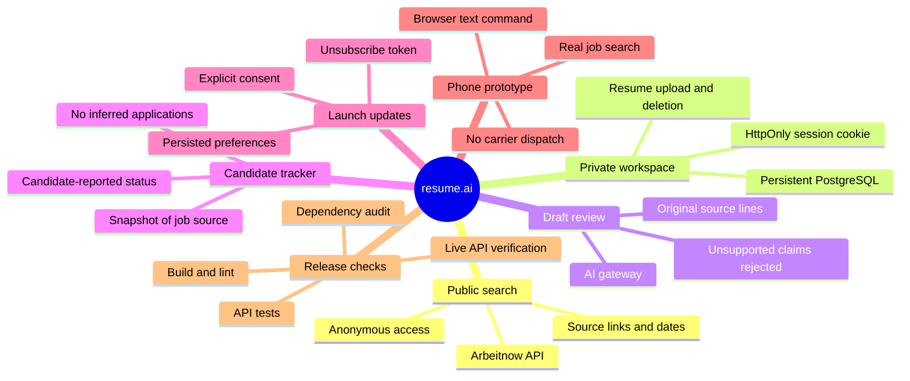

# System Map

```mermaid
mindmap
  root((resume.ai))
    Public search
      Arbeitnow API
      Source links and dates
      Anonymous access
    Private workspace
      HttpOnly session cookie
      Persistent PostgreSQL
      Resume upload and deletion
    Draft review
      Original source lines
      AI gateway
      Unsupported claims rejected
    Candidate tracker
      Snapshot of job source
      Candidate-reported status
      No inferred applications
    Launch updates
      Explicit consent
      Persisted preferences
      Unsubscribe token
    Phone prototype
      Browser text command
      Real job search
      No carrier dispatch
    Release checks
      API tests
      Build and lint
      Dependency audit
      Live API verification
```

See [[Launch Status]] for the boundary between implementation and live operation.
